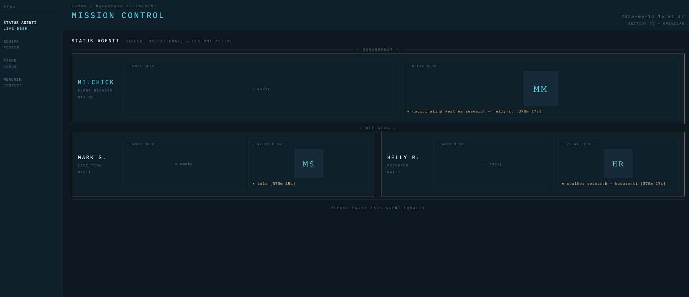

# OpenClaw pe VPS — Agenti AI cu Personalitate (Severance Edition)

Repo pentru [videoul](https://youtu.be/fNxqCm8U0p0) despre **OpenClaw** — o platforma open-source care iti permite sa rulezi agenti AI direct pe VPS-ul tau.

## Ce gasesti aici

```
prompts/
  milchick.md          — Prompt complet pentru agentul coordonator
  mark.md              — Prompt complet pentru agentul de executie
  helly.md             — Prompt complet pentru agentul de cercetare
  mission-control.md   — Prompt pentru dashboard-ul Mission Control
  intrebari-devops.md  — Prompt pentru quiz DevOps recurent
  munca-de-noapte.md   — Prompt pentru task-uri automate overnight

poze-agenti/           — Pozele personajelor din Severance folosite ca referinta
mission-control-ui/    — Screenshots din dashboard-ul Mission Control
```

## Instalare OpenClaw pe VPS

### 1. Pregateste VPS-ul

Conecteaza-te ca root si creeaza un user nou:

```bash
adduser lumon
usermod -aG sudo lumon
passwd lumon
exit
```

Reconecteaza-te cu noul user:

```bash
ssh lumon@<ip-serverul-tau>
```

### 2. Instaleaza Claude CLI

```bash
curl -fsSL https://claude.ai/install.sh | bash
```

### 3. Instaleaza OpenClaw

Site oficial: [openclaw.ai](https://openclaw.ai)

```bash
curl -fsSL https://openclaw.ai/install.sh | bash
```

### 4. Porneste OpenClaw

```bash
openclaw onboard --install-daemon
openclaw gateway run
openclaw dashboard --no-open
```

### 5. Acceseaza dashboard-ul de pe masina locala

OpenClaw ruleaza pe VPS, dar dashboard-ul il poti accesa de pe laptop prin SSH tunnel:

```bash
ssh -N -L 18789:127.0.0.1:18789 lumon@<ip-serverul-tau>
```

Deschide in browser:

```
http://localhost:18789/
```

## Cum am folosit agentii

### Echipa de agenti

| Agent | Rol | Prompt | Poza |
|-------|-----|--------|------|
| **Mr. Milchick** | Coordonator de Etaj | [`prompts/milchick.md`](prompts/milchick.md) |  |
| **Mark S.** | Executie tehnica | [`prompts/mark.md`](prompts/mark.md) |  |
| **Helly R.** | Cercetare si analiza | [`prompts/helly.md`](prompts/helly.md) |  |

### Pasul 1 — Creeaza coordonatorul (Mr. Milchick)

Foloseste prompt-ul din [`prompts/milchick.md`](prompts/milchick.md) pentru a crea agentul principal. Acesta va coordona echipa si va delega task-uri catre ceilalti agenti.

### Pasul 2 — Adauga sub-agentii

Cere-i lui Milchick sa creeze sub-agentii folosind prompt-urile:

- **Mark S.** ([`prompts/mark.md`](prompts/mark.md)) — executie tehnica, cod, scripturi
- **Helly R.** ([`prompts/helly.md`](prompts/helly.md)) — cercetare, documentatie, analiza

Prompt pentru creare sub-agent:
```
Vreau sa il creezi pe Mark S. ca subagent al tau cu acest fisier care reprezinta identitatea lui
```

### Pasul 3 — Construieste ceva impreuna

Am cerut echipei sa construiasca un dashboard Mission Control. Prompt-ul complet este in [`prompts/mission-control.md`](prompts/mission-control.md).

Asa arata rezultatul:



> **Bonus:** In `mission-control-ui/dbz-mission-control.png` gasesti si varianta mea personala de Mission Control — cu tema Dragon Ball Z.

### Bonus — Automatizari

- **Quiz DevOps** ([`prompts/intrebari-devops.md`](prompts/intrebari-devops.md)) — agentii iti trimit intrebari de interviu la fiecare 5 minute
- **Munca de noapte** ([`prompts/munca-de-noapte.md`](prompts/munca-de-noapte.md)) — agentii lucreaza cat timp tu dormi si iti trimit raport dimineata

## Arhitectura

```
Tu (laptop) ──SSH tunnel──> VPS (OpenClaw)
                              ├── Mr. Milchick (coordonator)
                              │     ├── Mark S. (executie)
                              │     └── Helly R. (cercetare)
                              └── Mission Control (dashboard)
```

## Link-uri utile

- [OpenClaw](https://openclaw.ai) — site oficial
- [ravtech pe YouTube](https://youtu.be/fNxqCm8U0p0) — canalul unde gasesti videoul complet

---

**"Please enjoy each agent equally."** — Mr. Milchick
